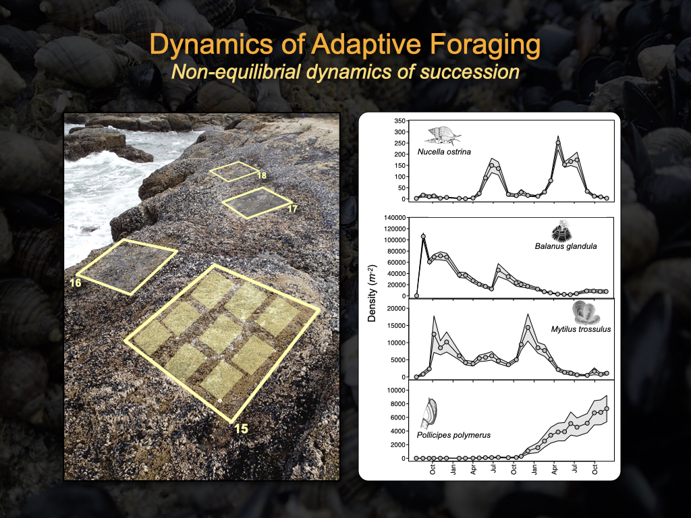
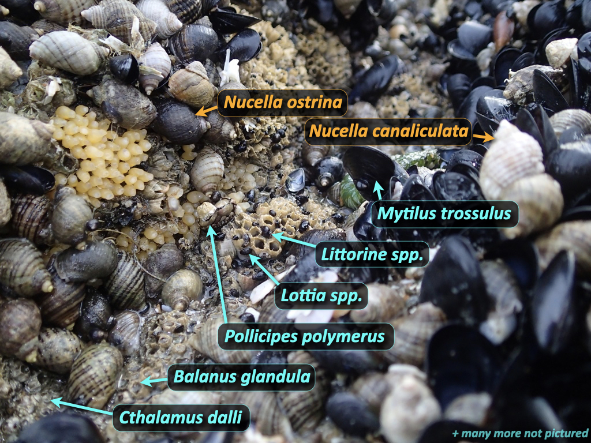
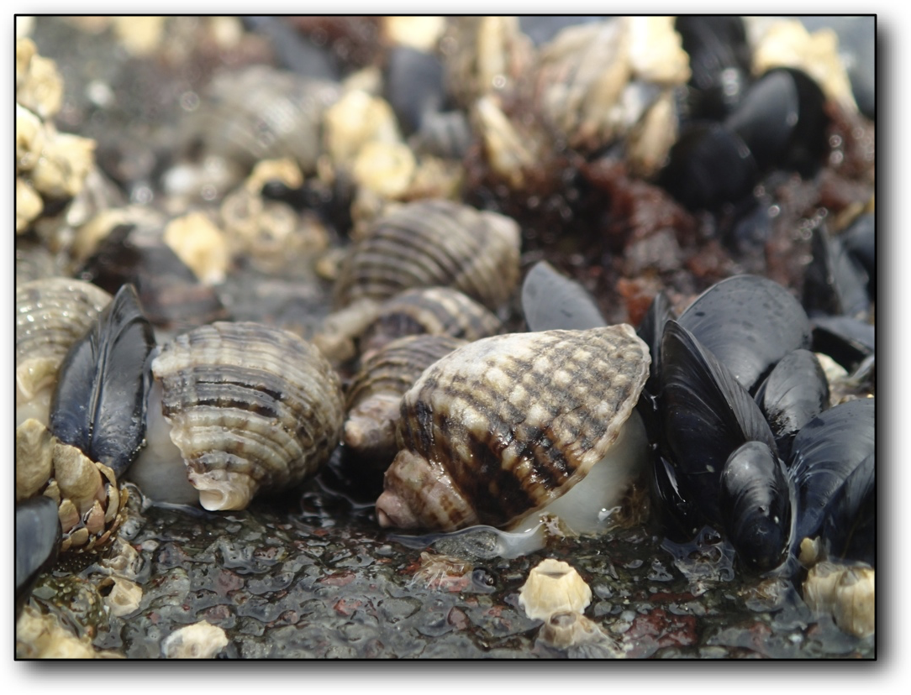
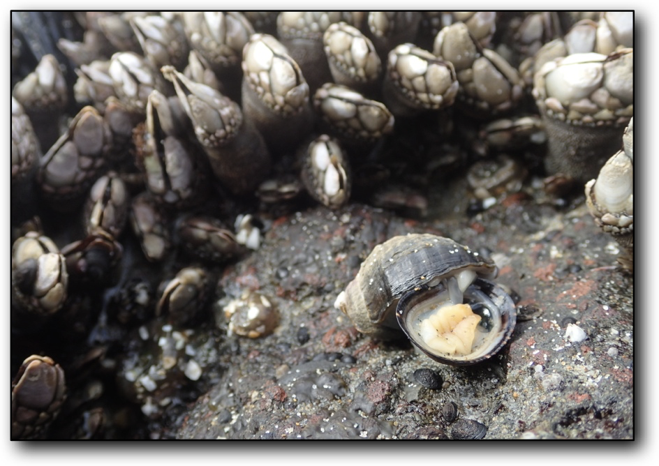

# [EECS Project](https://eecs.oregonstate.edu/capstone/submission/pages/viewSingleProject.php?id=XsGFkIR7OR5RqvfA): Serial image analysis to infer spatially-explicit species dynamics
Develop, train, and implement new or off-the-shelf image recognition algorithms to identify and enumerate species in a large collection of fixed-location photographs that were taken repeatedly (on a monthly basis) over three years in a unique experiment of ecological succession.

## Objectives
The aim of the here-proposed project is to help disentangle the role of species interactions in driving the abundance dynamics of a species-rich community in the Oregon marine intertidal. The collection of images represents 108 fixed-location time-series (each 36 months long for a total of ~3,888 images) in which the identity of ten to several hundreds of individuals requires determination. With some individuals surviving (and growing) over the entire time-series and others being present in only a single photograph, the time-series nature of these images offers both informative information on which to capitalize and challenges associated with the probabilistic prediction of rare occurrences. Key to success will be the optimized utilization of a painstakingly amassed set of 1,944 "training set" images in which the identity and precise x-y location of each individual has been recorded "by hand". Progress towards achieving the goals of this project, while informative and useful in their own right, will lead the way for numerous additional projects focused on understanding the dynamics of complex ecological systems, enabling more powerful statistical and machine learning approaches for which the current “training” dataset alone is poorly suited.

## Motivations
Understanding how and why species abundances vary in space and over time represents a fundamental and pressing challenge for the field of Ecology. Many processes influence species abundances, including both extrinsic disturbances such as weather events, seasonality, and climate change, and intrinsic processes such as birth-death events, predator-prey interactions, and competition for limited resources. These multi-dimensional processes inherent to species-rich ecological communities mirror the processes that underlie complex adaptive systems in general.

## Data Overview
#### 9 Quadrats in 18 Patches for ~3 years
The experiment was conducted at Yachats Beach, OR.  In July 2013, we established 18 randomly-located _patches_ in the mussel bed of this site by scraping away all living material within them.  Each patch was created as a square, 1.5 x 1.5 meters in size, had large bolts drilled into two opposing corners so that it could be relocated over time.  The 18 patches are labelled by letters: _A, B, C,...,F, G, AB, AC,..., AE_ (there is no _AA_ patch).  Within each patch we established 9 randomly-located _quadrats_, each 25 x 35 cm large, by placing small bolts in two opposing corners.  The quadrats are numbered _1-9_ (hence _AC9_ refers to the _9th_ quadrat in patch _AC_).

For the next ~3 years, we returned to the site each month to survey species' ensuing population dynamics.  That is, we followed the system's patterns of succession.  (A handful of months were missed due to dangerous wave conditions.)

Each month, each of the 18 x 9 = 162 quadrats was photographed.  We then used [ImageJ](https://imagej.nih.gov/ij/index.html) to locate (x-y coordinates) and count the individuals of every identifiable "species" in a subset of the pictures.  That is, because of the amount of time required to process each picture, we could only manage to process _3 of the 9 quadrats_ in each patch over the entire duration of the time-series.  (In each patch, the 3 focal quadrats are always the same 3 quadrats for the entire time series.)  These data for 18 x 3 = 54 quadrats per survey represent the _training data_.

The ultimate goal is to train machines to identify species in the remaining 18 x 6 = 108 images per survey.

#### Data location
The **_training data_** files (_1,944 images total_) --- including pictures (_jpg_ format), the hand-counts of prey types (_xls_ format), and x-y location of each identified individual (_xml_ format) --- are located in the [ExpPatchPics-Processed](/ExpPatch-Pics/ExpPatchPics-Processed) directory within the [ExpPatch-Pics](/ExpPatch-Pics) directory of this Git respository, orgranized by survey date.

The **_unprocessed pictures_** (_3,888 images total_) are _not_ located in this Git repository (due to GitHub space limits).  Instead, they reside on an [OSU _Box_ account](https://oregonstate.box.com/s/bsha00bay1secmyk1s2yuay0y7uqd5ec), organized by survey date (with "-NP" foldername suffice for "not processed").

## Overarching Goal(s)
We hand-counted [27 type categories](/data/data_orig/ExpPatch_SpeciesTypesID.txt) of "species" in the training dataset. The ability to automate the counting of any, and any number, of these species is desirable.  That said, the primary species of interest are the acorn barnacle [_Balanus glandula_](https://inverts.wallawalla.edu/Arthropoda/Crustacea/Maxillopoda/Cirripedia/Balanus_glandula.html) (_Bg_, Type 1) the gooseneck barnacle [_Pollicipes polymerus_](https://www.centralcoastbiodiversity.org/goose-neck-barnacle-bull-pollicipes-polymerus.html) (_Pp_, Type 11), and the mussel [_Mytilus trossulus_](https://www.centralcoastbiodiversity.org/pacific-blue-mussel-bull-mytilus-trossulus.html) (_Mt_, the combination of Type 7 and Type 15).  These are the most abundant species in the patches.  They are also the primary prey to the focal predator species, [_Nucella ostrina_](https://www.centralcoastbiodiversity.org/northern-striped-dogwinkle-bull-nucella-ostrina.html) whelks, whose feeding behaviour we are studying in the lab and with other EECS teams.

The three species of primary interest can, however, look an awful lot like some of the other, less common species.  In particular, _Balanus glandula_ can look a lot like two other acorn barnacles, _Chthamalus dalli_ and _Semibalanus cariosus_.  Further, _Mytilus trossulus_ looks a lot like _Mytilus californianus_.  (In fact, the two _Mytilus_ species can't be distinguished when they're small, hence the Type 15 "_Mytilus_sp_" category.)  Therefore, although it may at first seem easier to train machines one species at a time, it may be necessary to train machines on multiple species simultaneously (e.g. to focus on creating an "acorn barnacle machine".)

## Contact Information
[Mark Novak](https://novaklabosu.github.io) (mark.novak@oregonstate.edu)

